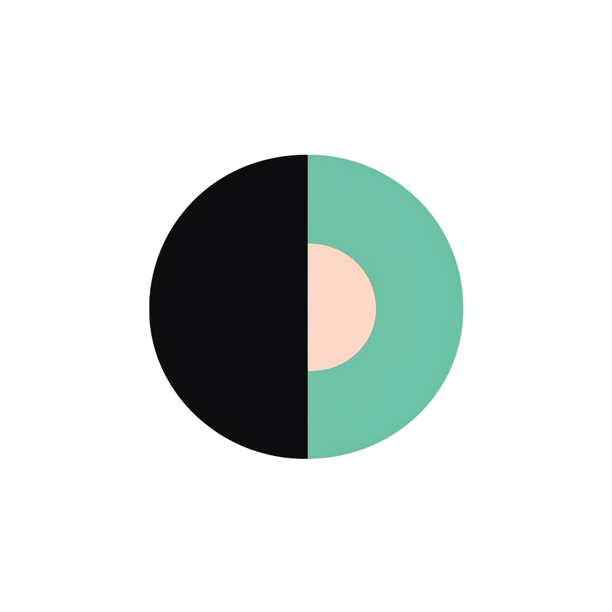

# Dis app





Это репозиторий для моего школьного проекта который представляет собой подобие Discord. 
tech stack: Next.js, React, Prisma, Tailwind, Postgres

## Таблица контента

- [TODO](#TODO)
- [Зависимости](#dependencies)
- [Запуск приложения](#running-the-app)
- [Вклад в проект](#contributing)
- [Лицензия](#license)

Функционал:

- Управление участниками (Исключение, Изменение роли Гостя/Модератора)
- Генерация уникальной ссылки-приглашения и полностью работающая система приглашений
- Создание и настройка сервера
- Прекрасный пользовательский интерфейс с использованием TailwindCSS и ShadcnUI
- Полная адаптивность
- Светлая/темная тема
- ORM с использованием Prisma
- База данных Postgres
- Аутентификация с использованием Clerk

## TODO
<a id="TODO"></a>
- Обмен сообщениями в режиме реального времени с использованием Socket.io
- Рендер страницы канала
- Возможность выйти с сервера и его удаление
- deploy

### Зависимости
<a id="dependencies"></a>
Версия Node 18.x.x

## Запуск приложения
<a id="running-the-app"></a>
### Клонирование репозитория

``` shell
git clone https://github.com/dedbin/dis_app.git
```
### Установка пакетов

``` shell
npm i
```
### Настройка файла .env


``` js
NEXT_PUBLIC_CLERK_PUBLISHABLE_KEY=
CLERK_SECRET_KEY=
NEXT_PUBLIC_CLERK_SIGN_IN_URL=
NEXT_PUBLIC_CLERK_SIGN_UP_URL=
NEXT_PUBLIC_CLERK_AFTER_SIGN_IN_URL=
NEXT_PUBLIC_CLERK_AFTER_SIGN_UP_URL=

DATABASE_URL=

UPLOADTHING_SECRET=
UPLOADTHING_APP_ID=
UPLOADTHING_URL = 
```
### Настройка Prisma

Добавьте базу данных Postgres

``` shell
npx prisma generate
npx prisma db push
```

### Запуск приложения

``` shell
npm run dev
```

## Вклад в проект
<a id="contributing"></a>
Вклад в этот проект приветствуется! Если вы хотите внести свой вклад в этот проект, пожалуйста, выполните следующие действия:

1. Fork репозиторий и клонируйте на свой компьютер:

``` shell
git clone https://github.com/dedbin/dis_app.git
```


2. Создайте новую ветку для своей фичи:

``` shell
git checkout -b feature/your-feature-name
```


3. Внесите свои изменения и закоммитьте их с сообщением которое кратко опишет вашу фичу:

``` shell
git commit -m "Add new feature: your feature name"
```

Также вы можете просто написать мне в telegram: [@math_is_ez](https://t.me/math_is_ez)


## Лицензия
<a id="license"></a>
Вы можете найти данную лицензию [здесь](https://github.com/dedbin/dis_app/LICENSE).
